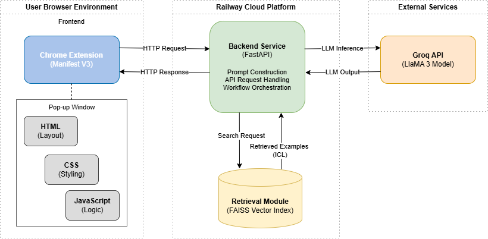
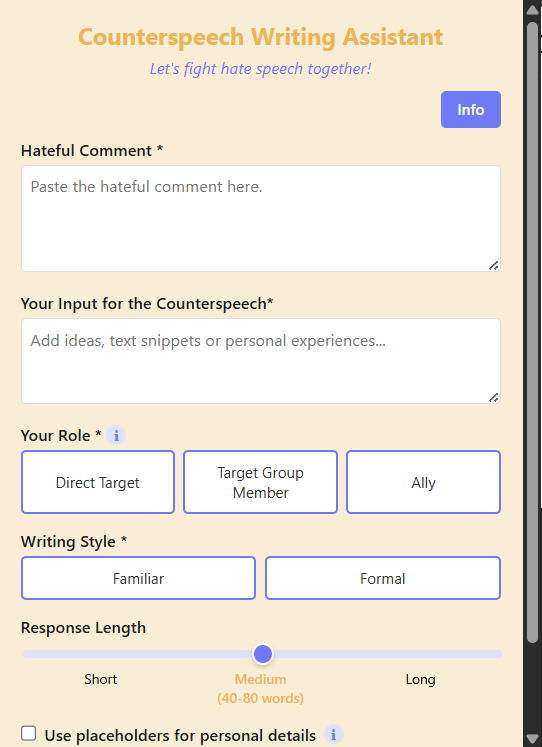

# Counterspeech Writing Assistant: <br> Human–AI Collaboration for Combating Hate Speech 

<br clear="left"/>

This repository contains the source code, data, and evaluation scripts for a Bachelor's thesis project that designed, developed and evaluated an AI-powered browser extension for **Counterspeech (CS)** writing assistance. 

#### Motivation: 
CS represents a constructive alternative to deletion-based moderation practices in the combat against online hate speech. Recognizing both the significant effort and skills required for manually crafted responses, as well as the lack of authenticity and meaningful human involvement in fully automated systems, this work explored **Human–AI Collaboration** as a middle ground capable of combining the generative power of modern LLMs with users' personal voice. The ultimate goal is to help users in formulating CS that is both effective and authentic.


> **Warning:** This repository contains datasets with hateful content directed toward various groups (disabled, Jewish, LGBTQ+, migrants, Muslims, POC, women, and others). This content is included strictly for research and CS development purposes.

-----

## System Overview

### ✨ Key Features

* **Guided Input:** Tailors responses based on user provided input (hate speech comment, CS input, role, style, and length).
* **In-Context Learning:** Fetches similar examples from the *Multitarget CONAN* dataset for in-context learning.
* **Prompt Engineering:** Steers an LLM via the Groq API to generate effective CS.
* **User Choice:** Returns three distinct suggestions to provide variety and choice.
* **Human-in-the-Loop:** Users can post-edit and copy suggestions, ensuring the final output remains authentic and human-controlled.
  
### 🛠️ Architecture



### 📊 Dataset

The project uses the [**Multitarget-CONAN**](https://github.com/marcoguerini/CONAN) dataset.

  * The provided `data/Multitarget-CONAN_withoutexamples.csv` excludes the 8 specific instances used during the user study to prevent bias.
  * To use the full dataset, update the data path in `backend/config.py` (lines 24/25).

### 📷 Screenshot of pop-up window



(For more screenshots, see \assets folder)

-----

## How to Use

### 🚀 Option 1: Quick Start (Valid until May 31, 2026)

The backend is currently hosted on Railway. You only need to install the frontend:

1.  Download **`Browser_Extension.zip`** from the root directory.
2.  Unpack the zip file on your local machine.
3.  Open Google Chrome* and navigate to `chrome://extensions/`.
4.  Enable **"Developer mode"** (toggle in the top right corner).
5.  Click **"Load unpacked"** and select the folder where you extracted the zip.
6.  Click on the puzzle icon in the top right corner of your browser bar and pin the Counterspeech Extension.
7.  Open a new tab website of your choice** and click on the icon (orange "C" on a purple background) and you're ready to go!

(*If you want to use a different browser, check how to manually load an extension there.)
(**Extension don't operate while you are on chrome:// pages)

### 💻 Option 2: Local Setup (Required from June 1, 2026)

**Python Version:** 3.14.0

To run the full stack locally, follow these steps:

#### 1\. Clone & Install

```bash
git clone https://github.com/tammyschmidt/Counterspeech_Extension
cd counterspeech_extension
pip install -r requirements.txt
```

#### 2\. Environment Variables

Create a `.env` file in the root directory and set the following variables:

  * `GROQ_API_KEY`: Your personal key from [Groq Console](https://console.groq.com/keys).
  * `GROQ_MODEL`: `llama-3.3-70b-versatile`*.
  * `EMBEDDING_MODEL_NAME`: `all-mpnet-base-v2`*.
  * `RETRIEVAL_TOP_K`: `5`*.
  * `API_HOST`: `127.0.0.1`*.
  * `API_PORT`: `8000`*.
  * `CORS_ORIGINS`: `chrome-extension://[EXTENSION_ID]` (you can find the extension's ID at `chrome://extensions/`).

  (* Configurations as used in the study - feel free to experiment with different variables)

#### 3\. Frontend Configuration

In `frontend/popup.js`, update lines 6/7 to point to your local backend:

```javascript
const API_BASE_URL = "http://127.0.0.1:8000"; 
```

#### 4\. Run the Application

**Terminal 1 (Backend):**

```bash
uvicorn backend.main:app --reload
```

**Terminal 2 (Frontend):**

```bash
cd frontend
npm install
npm run dev
```

(The `railway.json` and `Procfile` can be ignored when the application is run locally.)

### 🔍 Reproducing Analysis

To reproduce the data analysis and visualizations from the thesis study:

<!-- end list -->

```bash
cd evaluation
pip install -r requirements.txt
python analysis.py
```

-----

## Thesis Paper

The complete thesis, detailing the system design, implementation, and the results of the user study, can be found in the root directory:
`Thesis.pdf`

-----

## License

This project is licensed under the **MIT License**.

Copyright (c) 2026 [Tammy Schmidt]
